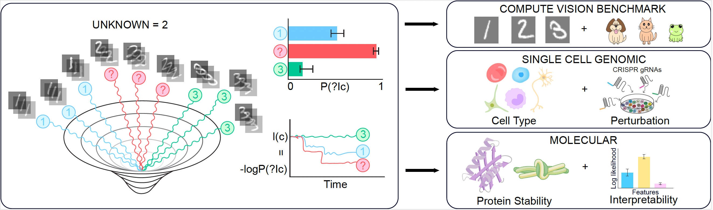

# Keeping SCORE
[](https://www.biorxiv.org/content/10.1101/2025.11.26.690838v1)
[](https://github.com/GoyalLab/KeepingScore)
[](LICENSE)

Code for **"Interpretable Thermodynamic Score-based Classification of Relaxation Excursions"**.



## Getting the Code

> **Important:** This repository uses **[Git LFS](https://git-lfs.com/)**. A plain `git clone` will *not* work unless `git-lfs` is installed first — the clone itself succeeds, but the checkout fails partway through:
>
> ```
> git-lfs filter-process: git-lfs: command not found
> fatal: the remote end hung up unexpectedly
> warning: Clone succeeded, but checkout failed.
> ```
>
> Expect roughly **0.6 GB** of Git history plus **~6.7 GB** of LFS content after checkout, so make sure you have **≥ 8 GB** free on a filesystem that allows it (on HPC, prefer scratch/project space over `$HOME`).

### 1. Install Git LFS

```bash
# conda / mamba (works without root — recommended on HPC)
mamba install -c conda-forge git-lfs

# or, with system package managers
sudo apt-get install git-lfs      # Debian/Ubuntu
brew install git-lfs              # macOS
```

Verify with `git lfs version`.

### 2. Register the LFS filters

```bash
git lfs install
```

<details>
<summary>If this fails with <code>permission denied</code> on a shared/HPC filesystem</summary>

Running `git lfs install` from inside a directory that belongs to another Git repository (common on shared cluster paths) makes it try to write hooks you may not own:

```
open /gpfs/projects/.../.git/hooks/pre-push: permission denied
```

Any of these will resolve it:

```bash
git lfs install --skip-repo   # write only the global config, touch no hooks
cd ~ && git lfs install       # run from a directory outside any foreign repo
git lfs update --force        # overwrite the existing hooks (only if the repo is yours)
```
</details>

### 3. Clone

```bash
git clone https://github.com/GoyalLab/KeepingScore.git
cd KeepingScore
```

A successful clone ends with a `Filtering content: 100% ...` line — that stage is Git LFS downloading the large files.

<details>
<summary>Already cloned before installing Git LFS?</summary>

No need to re-clone. Install `git-lfs` as above, then from inside the repository:

```bash
git lfs install --skip-repo
git lfs pull
git restore --source=HEAD :/   # restore any files left as LFS pointer stubs
```
</details>

<details>
<summary>Want the code without the large files?</summary>

Skip the LFS download at clone time and fetch only what you need later:

```bash
GIT_LFS_SKIP_SMUDGE=1 git clone https://github.com/GoyalLab/KeepingScore.git
cd KeepingScore
git lfs pull --include="path/to/needed/files"
```
</details>

## Project Structure

> **Compute note:** Items **1, 2, and 5** can typically be run on a local machine. Items **3 and 4** are more likely to require **HPC/GPU** resources.

1. **MNIST**  
   - `VAE_MNIST.ipynb`: create VAE embeddings from MNIST  
   - `MNIST_final.ipynb`: diffusion model training, classification, and analysis (Fig. 3)

2. **CIFAR10**  
   - `CIFAR10.ipynb`: data loading, joint VAE+diffusion training, classification, analysis (Fig. 3)

3. **Cell Type Analysis (`celltype`)**  
   Benchmarking scripts for cell-type classification (Fig. 4).  
   **Models:** Linear, Logistic Regression, MLP, XGBoost, scTab  
   [](https://github.com/GoyalLab/KeepingScore/blob/main/celltype/README.md)

4. **Genetic Perturbation Analysis (`perturb-seq`)**  
   Benchmarking scripts for Perturb-seq analysis (Fig. 4).  
   **Models:** Logistic Regression, MLP, XGBoost  
   [](https://github.com/GoyalLab/KeepingScore/blob/main/perturb-seq/README.md)

5. **Protein Stability**  
   - `protein.ipynb`: protein stability data loading, joint VAE+diffusion regression training, analysis (Fig. 5)

## Requirements

| Component | Python | Notes |
|---|---:|---|
| Git LFS | — | Required to check out the repository (see [Getting the Code](#getting-the-code)) |
| Cell Type Analysis | 3.8 | See `SCTAB_FINAL` environment `scTAB_environment_fixed.yml` + README |
| Perturb-seq Analysis | 3.10+ | See `perturb-seq` environment `DL_py3.10_repro.yml` + README |
| Hardware | — | GPU recommended for both; HPC likely for large runs |

## Citation
If you use this code, please cite:

> **Interpretable Thermodynamic Score-based Classification of Relaxation Excursions**  
> bioRxiv (2025). https://doi.org/10.1101/2025.11.26.690838

## License
Released under the **MIT License** (see `LICENSE`).

## Questions
Please contact **Ben Kuznets-Speck** (biophysben@gmail.com).
