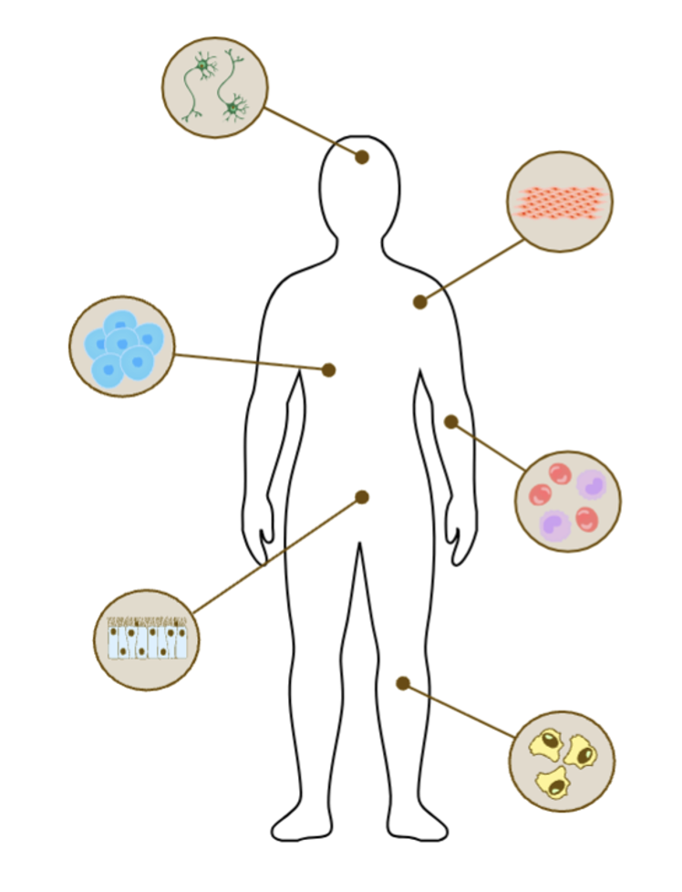

# Keeping SCORE: scRNA-seq Cell Type Analysis
## Overview
<p align="center">
  
</p>

This directory contains the full pipeline for scRNA-seq based cell type analysis, including diffusion-based representation learning, Keeping SCORE–based classification, and benchmark classifiers (MLP, XGBoost, linear model, logistic regression, and scTab).

## Requirements 
- tSNE plot for the visualization of the test embedding was executed on the high-memory RAM (1,000 GB). 
- All GPU-dependent components were executed on NVIDIA A100 GPUs.

## Environment Setup
Follow the steps below to reproduce the scRNA-seq cell type classification environment.

### 1. Create the Conda/Mamba environment
```bash
mamba env create --prefix $TARGET_DIR/KS_celltype --file KS_celltype.yml
```
```bash
echo $CONDA_PREFIX
```
### 2. Activate Mamba environment 
```bash
mamba activate $TARGET_DIR/KS_celltype
```
### 3. Install Jupyter kernel support
```bash
mamba install ipykernel -y
```
```bash
python -m ipykernel install --user \
    --name KS_celltype \
    --display-name "KS_celltype"
```
### 4. Install GPU-enabled XGBoost 
```bash
CONDA_OVERRIDE_CUDA="11.1" mamba install -c conda-forge xgboost=1.6.2=cuda111* cudatoolkit=11.1
```

## Data structure

The directory is organized as follows (generated SLURM logs and `.DS_Store` files are omitted):

```text
celltype/
├── embeddings/
│   └── embeddings_computation/
│       ├── train_emb.py, val_emb.py, test_emb.py
│       └── train.sh, val.sh, test.sh
├── diffusion_model/
│   ├── diffusion_model.py
│   └── model.sh
├── timestep_analysis/
│   └── variance_based_sampling/
├── benchmark/
│   ├── models/
│   ├── checkpoints/
│   └── benchmark_plot.ipynb
├── scTab_files/
│   ├── emb_cellnet/
│   ├── merlin_cxg_2023_05_15_sf-log1p/
│   ├── scTab-checkpoints/
│   ├── scTab-devel/
│   └── README.md
├── attribution_analysis/
│   ├── cell_type_clustering/
│   ├── datapoint_extraction/
│   ├── attribution_plot/
│   └── keeping_score/
├── KS_celltype.yml
├── testemb_tSNE_plot.ipynb
└── README.md
```

- `embeddings/embeddings_computation`: Train, validation, and test scripts and launchers for extracting **scTab embeddings** from the feature transformer. Embedding extraction requires **very high memory (≥1,000 GB RAM)** and may take **multiple days**.
- `diffusion_model`: Conditional diffusion-model training code and launcher used by **Keeping SCORE**.
- `timestep_analysis/variance_based_sampling`: Timestep-subsampling scripts and notebook for the analysis illustrated in Figure 4C.
- `benchmark/models`: Training and evaluation code for Keeping SCORE (path 4 and path 256), MLP, TabNet/scTab, XGBoost, linear, and logistic-regression models. `benchmark/checkpoints` stores model outputs, and `benchmark/benchmark_plot.ipynb` compares benchmark results.
- `scTab_files`: External scTab resources, including the Merlin dataset, downloaded pretrained checkpoints, the scTab source tree, and the embedding-aware `emb_cellnet` estimator/model code.
- `attribution_analysis`: Attribution workflows for latent-space kNN cell-type clustering, sampled and mean datapoint extraction, Keeping SCORE attribution sampling, and attribution plotting.
- `KS_celltype.yml`: Conda/Mamba environment specification for the cell-type analysis.
- `testemb_tSNE_plot.ipynb`: Notebook for visualizing the scTab test embeddings with t-SNE (Figure 4A and Figure S3).

## Data Source

Details on the **scTab** datasets and file formats are available at:  
https://github.com/theislab/scTab

For this analysis, please download the following 164GB dataset:

https://pklab.med.harvard.edu/felix/data/merlin_cxg_2023_05_15_sf-log1p.tar.gz

Manually transfer the file to the target directory and unzip the file with the following command. 

```bash
tar -xvzf merlin_cxg_2023_05_15_sf-log1p.tar.gz
```
Note that the `emb_cellnet` - `estimators.py` file is a modified version of `cellnet` from https://github.com/theislab/scTab to load the extracted embeddings instead of the raw scRNA-seq data.
